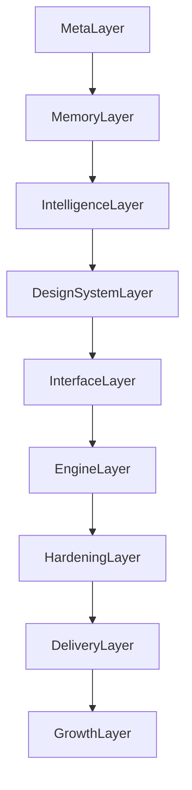

## NEXUS APEX v4.0 — Blueprint

### Core intent

Build a modular, web-focused (Next.js 15) skill engine architecture where:

- Every engine emits **typed contract artifacts**
- `00_CORE` validates contracts and routes work
- `0A_ANTISLOP` prevents low-quality or unsafe behavior
- `0H_HERMES` improves the system with explicit approval + audit + effectiveness tracking
- Optional external tools are wrapped by `0P_PLUGINS` with native fallbacks

### Layer model (8 layers)

### Phases (build order)

- **Phase 0**: Scaffold folders + docs + examples + placeholders
- **Phase 1**: META vertical slice validation gate (00_CORE + 0A_ANTISLOP + 0H_HERMES + 0P_PLUGINS + 90_MEMORY + proof-engine)
- **Phase 2**: Build all domain engines layer-by-layer
- **Phase 3**: Polish + validate; migrate operator layer and finalize quality gates

### Contract-first rule

Engines do not hand-wave. They output artifacts. The next engine consumes those artifacts. All artifacts are schema validated.

### Token efficiency rule

All engines follow progressive disclosure:

- **L1**: metadata + triggers + minimal “what to do”
- **L2**: main instructions (bounded)
- **L3**: resources/examples loaded only when triggers fire or when explicitly invoked

